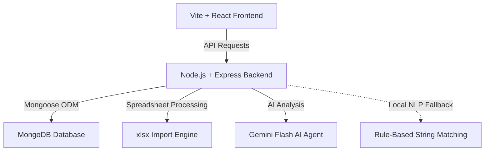

# Applywizz Recruiter Portal

Applywizz is a full-stack recruitment platform designed to help recruiters efficiently import, search, analyze, deduplicate, and manage job postings, as well as match candidate resumes against specific roles. 

This repository contains the complete source code, database design, deduplication engine, and an AI-driven Resume Tailoring Agent.

---

## 🚀 Key Features

*   📊 **Recruiter Dashboard**: High-level metrics tracking total job listings, unique companies, duplicate jobs, and interactive hiring analytics (top-hiring companies, location distribution, remote ratio).
*   🔍 **Advanced Job Search**: Instant searching with multi-filter parameters (company, location, employment type, remote, experience range, salary range) combined with sorting and pagination.
*   👯 **Intelligent Deduplication**: Automatic detection of duplicate or near-duplicate listings upon Excel import using weighted string similarity algorithms.
*   🛠️ **Duplicate Resolution Interface**: Side-by-side comparison of duplicate listings, allowing recruiters to confirm duplicates or re-classify them as unique canonical postings.
*   🤖 **AI Resume Tailoring Agent**: An intelligent module comparing candidate resume text against specific jobs to compute match scores, identify missing skills, highlight strengths, and provide resume improvement suggestions. (Includes a robust rule-based NLP fallback).

---

## 🏗️ System Architecture & Tech Stack



### Frontend
*   **Vite + React (v19)**: For a fast, responsive single-page application.
*   **Tailwind CSS (v4)**: Implementing a modern, sleek interface with interactive micro-animations.
*   **React Router Dom (v7)**: Manage public routes (`/login`, `/register`) and protected dashboard pages.
*   **Redux Toolkit**: Manage global states (auth, user profiles, notifications).

### Backend
*   **Node.js (ES Modules)**: Modern, asynchronous runtime.
*   **Express (v5.2.1)**: Lightweight web framework with custom global error-handling middlewares and uniform response decorators.
*   **Mongoose**: ODM to enforce schemas, validate indexes, and query MongoDB.
*   **Multer & XLSX**: Process uploaded job spreadsheet binary streams in memory.
*   **Google Generative AI SDK**: Integrates Gemini (`gemini-flash-latest`) for the Resume Tailoring Agent.

### Database
*   **MongoDB**: Document store hosting two core collections:
    *   `users`: Store credentials (hashed with `bcrypt`) and recruiter profiles.
    *   `jobs`: Store raw job data, normalized dimensions, and deduplication states (`isDuplicate`, `duplicateGroupId`, `duplicateScore`).

---

## 🛠️ Setup Instructions

### 1. Prerequisites
Ensure you have the following installed on your machine:
*   [Node.js](https://nodejs.org/) (v20.x or higher recommended)
*   [MongoDB](https://www.mongodb.com/try/download/community) (Local service running on port `27017` or a MongoDB Atlas connection string)
*   [Git](https://git-scm.com/)

---

### 2. Environment Variables Configuration

#### Backend Setup
Create a `.env` file in the `backend/` directory. You can copy the values from `backend/.env.example`:
```bash
# Navigate to backend directory
cd backend

# Create .env file
cp .env.example .env
```
Fill in the configuration details inside `backend/.env`:
```env
PORT=3000
MONGO_URI=mongodb://127.0.0.1:27017/applywizz # Use your MongoDB connection string
NODE_ENV=development
JWT_SECRET=your_jwt_signing_key_here # Choose a secure random string
CLIENT_URL=http://localhost:5173

# Gemini API Key (Required for AI Resume Tailoring Agent)
GEMINI_API_KEY=your_gemini_api_key_here
```

#### Frontend Setup
Create a `.env` file in the `frontend/` directory:
```bash
# Navigate to frontend directory
cd ../frontend

# Create .env file
echo "VITE_API_URL=http://localhost:3000/api/v1" > .env
```

---

### 3. Local Development Run

Follow these steps to spin up the backend and frontend simultaneously:

#### Step A: Start Backend Server
```bash
cd backend
npm install
npm run dev
```
The server will start on [http://localhost:3000](http://localhost:3000) (or the port defined in your `.env`).

#### Step B: Start Frontend Development Server
```bash
cd frontend
npm install
npm run dev
```
The client will spin up on [http://localhost:5173](http://localhost:5173).

---

### 4. Running with Docker

The application includes a root-level `dockerfile` that utilizes multi-stage builds. This compiles the frontend static assets and copies them into the backend container so that the Express server hosts both services.

To build and run the container:
```bash
# Build the Docker image
docker build -t applywizz-app .

# Run the Docker container (Map to port 3000)
docker run -p 3000:3000 --env-file ./backend/.env applywizz-app
```
> **Note**: If running database locally on your host machine, make sure to change `MONGO_URI` to point to the host IP (e.g., `mongodb://host.docker.internal:27017/applywizz`) in your env file before launching.

---

## 📊 Duplicate Detection Engine

The import module parses job postings from Excel spreadsheets and automatically cleans, normalizes, and groups duplicate jobs to prevent dataset inflation.

```
Incoming Row ──> Data Normalization ──> Fetch Canonical Candidates from DB
                                                    │
                                                    ▼
                                         Compute Combined Score:
                                      - Title (Jaro-Winkler) [50%]
                                      - Description (Jaccard) [30%]
                                      - Skills (Jaccard) [20%]
                                                    │
             ┌──────────────────────────────────────┴──────────────────────────────────────┐
             ▼                                                                             ▼
    Score >= 0.82 (82%)                                                           Score < 0.82 (82%)
[Mark as Duplicate + Link Group ID]                                              [Mark as Canonical Job]
```

### 1. Data Normalization (`dataNormalizer.js`)
*   **Company**: Trims whitespace, removes punctuation, lowercases, and strips legal suffixes (e.g., *LLC*, *Inc*, *Corp*, *Pvt Ltd*, *GmbH*).
*   **Location & Remote**: Identifies whether the position is remote by scanning keywords (e.g., *wfh*, *telecommute*, *anywhere*, *work from home*).
*   **Employment Type**: Standardizes input strings into a clean enum: `Full-time`, `Part-time`, `Contract`, `Internship`, `Temporary`, or `Other`.
*   **Experience & Salary Ranges**: Extracts minimum and maximum numerical parameters from free-text fields (e.g., `"5 to 10 years"` -> `min: 5, max: 10`, `"₹12L - 18L"` -> `min: 1200000, max: 1800000`).
*   **Date**: Formats Excel date numbers or relative strings (e.g., `"3 days ago"`) into valid ISO Date objects.

### 2. Similarity Scoring Algorithm (`import.service.js`)
When an Excel row is imported, the engine queries all existing canonical jobs under the same normalized company name. It calculates a similarity score for each candidate:
1.  **Job Title Similarity (50%)**: Calculated using the **Jaro-Winkler similarity algorithm**, which is ideal for matching short texts and handling typos/structural modifications.
2.  **Job Description Similarity (30%)**: Determined via **Jaccard similarity** on tokenized alphanumeric words, capturing semantic and topic overlaps.
3.  **Required Skills Similarity (20%)**: Evaluates overlap on the parsed list of normalized skills using **Jaccard similarity**.

$$\text{Combined Score} = (0.50 \times \text{Title Score}) + (0.30 \times \text{Desc Score}) + (0.20 \times \text{Skills Score})$$

If the combined score is **$\ge 0.82$ (82%)**, the new record is marked as `isDuplicate: true` and linked to the canonical matching record.

### 3. Intra-Batch Matching Cache
During bulk imports, the system caches newly created canonical records in memory (`batchCanonicalCache`). This ensures that duplicate listings appearing in the same spreadsheet are correctly grouped together before they are even written to the database.

---

## 🤖 AI Resume Tailoring Agent

The **Resume Tailoring Agent** allows recruiters to copy-paste candidate resumes and evaluate their match against a selected job.

1.  **AI Engine**: Passes the job specification and resume text to the **Gemini 1.5 Flash** model with strict guidelines to output structured data matching the profile.
2.  **Output Details**:
    *   `matchScore`: Rating out of 100 representing job alignment.
    *   `missingSkills`: Key technical skills missing from the resume.
    *   `strengths`: Candidate strengths matching the job requirements.
    *   `weaknesses`: Specific qualification gaps or concerns.
    *   `suggestions`: Actionable improvements to optimize the resume.
3.  **NLP Fallback**: If the Gemini API is offline, rate-limited, or key is unconfigured, the system automatically uses a custom **rule-based Jaccard similarity fallback** engine mapping skill regex and keywords to provide full functionality without crashing.

---

## 🔌 API Testing with Postman

An API collection is supplied at the project root: `Applywizz.postman_collection.json`. 

To use it:
1.  Open Postman and select **Import**.
2.  Choose the `Applywizz.postman_collection.json` file.
3.  The collection contains pre-configured requests under folders:
    *   **Authentication**: Register, Login, Get Profile, Logout
    *   **Dashboard & Analytics**: Get Dashboard Stats
    *   **Jobs Management**: Import Excel, Search Jobs, Get Job Details
    *   **Duplicates Resolver**: Get Duplicate Groups, Resolve Duplicate Group
    *   **AI Resume Tailor Agent**: Tailor Resume Against Job
4.  Cookies are automatically stored in the session, and a Postman test script automatically extracts JWT tokens from the login/register responses to authenticate subsequent requests.

---

## 💡 Assumptions & Design Decisions

*   **Auth Requirement**: Recruiters must sign up and authenticate to view metrics or import datasets. This safeguards job listings and candidate resume reviews.
*   **Single Deployment Container**: The project Dockerfile builds React as static files and copies them into the backend directory. This allows deploying a single unified server instead of managing multi-container deployments.
*   **Resume Input Vector**: The resume tailer accepts plain text instead of parsing binaries (PDF/Docx) directly in the UI. This minimizes overhead, prevents parsing inaccuracies from complex resume columns/graphics, and ensures high-quality AI prompts.
*   **MongoDB Schema Indexing**: Critical query keys like `titleNormalized`, `companyNormalized`, `experienceMin`, and `salaryMin` are indexed to keep searches and pagination fast on larger datasets.

---

## ⚠️ Known Limitations & Trade-offs

*   **Docker Static Asset Path Inconsistency**: 
    The Dockerfile copies frontend compiled files into `/backend/public`, while `app.js` is configured to serve static assets from `dist` (`app.use(express.static("dist"))`). 
    *Workaround*: In the Docker container build, please ensure files are copied to `/backend/dist` (or modify `app.js` to fallback to `public`).
*   **Database Scaling on Duplicate Lookups**: 
    Duplicate checking is executed sequentially for each row during imports. While fast for batches of up to a few thousand rows, extremely large spreadsheets (e.g., 50k+ rows) should be loaded asynchronously via background workers (e.g., BullMQ) to avoid blocking the Express request event loop.
*   **Local NLP Fallback Accuracy**: 
    The local rule-based Jaccard fallback is less context-aware than the Gemini API. It relies on exact word boundaries and array intersections, meaning it cannot detect synonymous skills (e.g., it might miss that "NodeJS" is the same as "Node.js" unless cleaned).
*   **Regex-based Job Search**:
    The main search query uses partial RegExp searches in MongoDB. While sufficient for keyword lookups, it does not support full semantic search (e.g., searching "frontend" might miss "UI Developer" unless the terms overlap).
